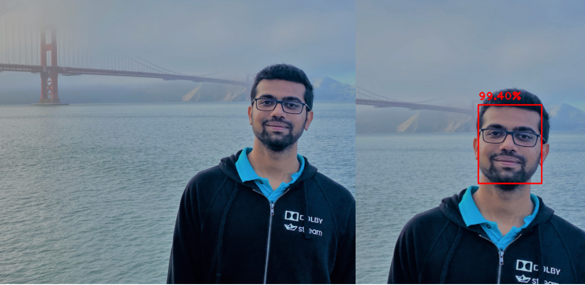

## face detection usin openCV

This repo contains code for detecting the faces using images and live cam/video

Below is the demo of the face detection using images.

To execute the file in your system, run below code in command promt.

__$ python detect_faces.py --image ./images/test.jpg --prototxt ./models/deploy.prototxt.txt --model ./models/res10_300x300_ssd_iter_140000.caffemodel__

